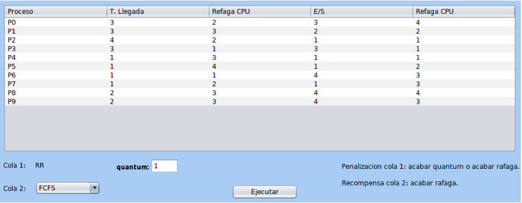
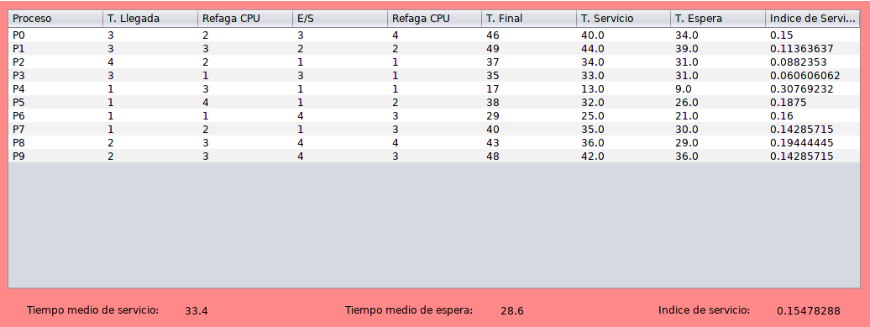
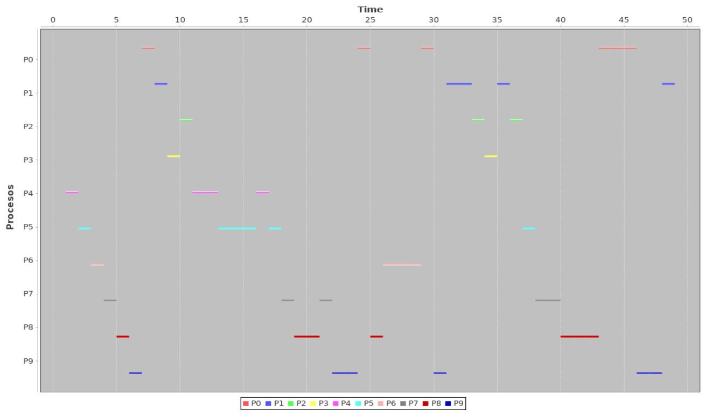

# Process planning simulator

This project was made for the operating systems course 2019 at the Universidad del Valle, Colombia.

The purpose is to simulate the process scheduling of an operating system using different algorithms such as RR, FCFS, SJN, HRN.

Two queues were implemented where the first (higher priority) has a preemptive policy (RR), the second (lower priority) has a non-preemptive policy with three algorithms that the user can choose (FCFS, SJN, HRN).

Penalty criteria were implemented in the first queue:
The process will be penalized when it finishes its quantum or executes its entire cpu burst.

Reward criteria were implemented in the second queue:
The process will be rewarded when it runs its entire burst.

The results (Waiting time, service time, final time instant, service index, as well as the average waiting and service time) are presented in tabular form.

This project was carried out using the Java programming language and Netbeans IDE.
The Jfreechart library was used to visualize the results as a Gantt chart.

[PDF Report](readme/SO_Project.pdf)

### Example:

#### Data

#### Results

#### Gantt chart

